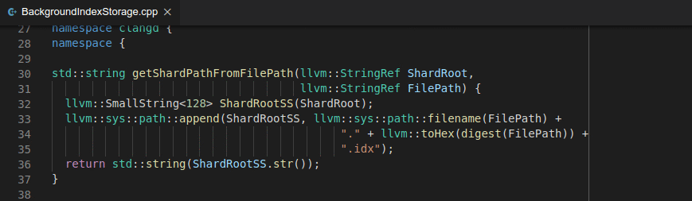

# Features

Here is what clangd can do for you.
Screenshots show [VSCode](https://code.visualstudio.com/); the available
features and UI will depend on your editor.



## Errors and warnings

clangd runs the clang compiler on your code as you type, and shows diagnostics
of errors and warnings in-place.

(Some errors are suppressed: diagnostics that require expanding templates in
headers are disabled for performance reasons).

### Fixes

The compiler can suggest fixes for many common problems automatically, and
clangd can update the code for you.

If a missing symbol was seen in a file you've edited recently, clangd will
suggest inserting it.
{:.v9}

### clang-tidy checks
{:.v9}

clangd embeds [clang-tidy](https://clang.llvm.org/extra/clang-tidy/) which
provides extra hints about code problems: bug-prone patterns, performance traps,
and style issues.

clangd respects your project's `.clang-tidy` file which controls the checks to
run. Not all checks work within clangd.
You must pass the `-clang-tidy` flag to enable this feature.

## Code completion

You'll see suggestions as you type based on what methods, variables, etc are
available in this context.

Abbreviating words may help you find the right result faster. If you type in
`camelCase` but the function you're looking for is `snake_case`, that's OK.

### Namespace and include insertion
{:.v8}

clangd will sometimes suggest results from other files and namespaces. In this
case the correct qualifier and `#include` directive will be inserted.

### Signature help

Some editors will show you the parameters of the function you're calling, as
you fill them in.

## Cross-references

These features let you navigate your codebase.

They work across the files you've opened.
{:.v7}

clangd will also automatically index your whole project.
{:.v9}

### Find definition/declaration

Jump to the definition or declaration of a symbol under the cursor.

(Some editors only expose "find definition" - hit it again to jump to the
declaration).
{:.v9}

This also works on #include lines, to jump to the included file.

### Find references

Show all references to a symbol under the cursor.

Some editors will automatically highlight local references to the selected
symbol as you move around a file.

## Navigation

clangd informs the editor of the code structure in the current file.
Some editors use this to present an outline view:

In VSCode, this also allows jumping to a symbol within the current file.

Searching for symbols within the scope of the whole project is also possible.

## Formatting

clangd embeds [clang-format](https://clang.llvm.org/docs/ClangFormat.html),
which can reformat your code: fixing indentation, breaking lines, and reflowing
comments.

clangd respects your project's `.clang-format` file which controls styling
options.

(Format-as-you-type is experimental and doesn't work well yet).

## Refactoring

### Rename

Rename a symbol under the cursor. All usages of the symbol will be renamed,
including **declaration**, **definition** and **references**.

Most symbols are renameable, such as classes, variables, functions and methods.

**KNOWN LIMITATIONS**
- unsupported symbols:
    namespaces, macros, non-identifier symbols (e.g. overloaded operators),
    virtual/overriden methods;
- some references are not renamed (likely need manual modifications):
  - references inside macro bodies
  - references in comments
  - references in generated files
  - references in platform-specific code
- templates maybe not perfect (explicit template specializations are missing, [b/280](https://github.com/clangd/clangd/issues/280))
- no guaranatee on ObjC?
- limit up to 50 files (to be friendly to editors)

> TIP: the rename experience highly depends on the editor you are using. Some
> editors, e.g. VSCode (v1.42.0 or later), provide a way to preview the rename
> changes before applying them; while some just apply the changes directly.
{:.tip}

#### Within-file rename
{:.v7}

This is by-default mode, which only allows to rename a local symbol (which is
only used in current main file).

#### Cross-file rename
{:.v10}

Under an experimental command-line flag `-cross-file-rename`.

The cross-file rename is based on the index, it is fast (no parsing of extra
files) by trading off some correctness. It is encouraged to perform it when the
index is **up-to-date** (e.g. background indexing is finished). But clangd will
try to patch up the results if the index is stale.
